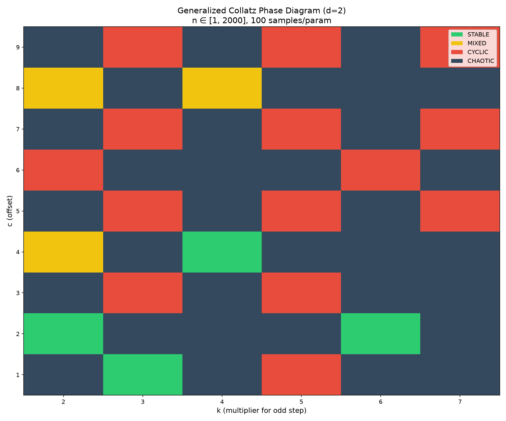

# Generalized Collatz Atlas — Experimental Report v2.1

**SUBIT-TOPOS Research Group**  
*Date: 2026-07-22*  
*Version: 2.1 (Final)*

---

## 1. Exploration Summary

- **Fixed divisor:** d = 2 (classic Collatz uses d=2)
- **Parameter space:** k ∈ [2,7], c ∈ [1,9] → **54 combinations**
- **Samples per parameter:** 100 random starting numbers from [1,2000]
- **Max steps:** 5,000 · **Max value:** 10¹²
- **Unique cycles found:** **38** (after canonical deduplication)

### Ω‑class Distribution

| Ω‑class | Count | Percentage |
|---------|-------|------------|
| **CHAOTIC** | 33 | 61.1% |
| **CYCLIC** | 14 | 25.9% |
| **STABLE** | 4 | 7.4% |
| **MIXED** | 3 | 5.6% |

> **Interpretation:** Only 4 out of 54 parameter combinations are fully stable (all 100 samples reach 1). The vast majority produce either cycles or trajectories that exceed the computational limit (CHAOTIC), indicating that the classical Collatz map (3,1) is an exceptional stable point in this parameter space.

---

## 2. Stable Parameters

Only four `(k, c)` combinations were fully stable (100/100 samples reached 1):

| k | c | stable_count | total_samples |
|--:|---:|------------:|--------------:|
| 2 | 2 | 100 | 100 |
| 3 | 1 | 100 | 100 *(classic Collatz)* |
| 4 | 4 | 100 | 100 |
| 6 | 2 | 100 | 100 |

> **Note:** The classic Collatz map `(3,1)` is stable, but small perturbations such as `(3,2)` or `(3,3)` immediately destabilise the system, producing cycles or chaotic behaviour.

---

## 3. Unique Attractor Catalog

**38 unique cycles** were discovered across the parameter space. Each cycle is listed with its associated `(k,c)`, length, and min/max values. Basin size (number of starting samples falling into each cycle) is not available due to aggregation; future work could store per‑sample cycle assignments.

| # | (k,c) | Cycle (first elements) | Length | Min | Max |
|---|-------|------------------------|--------|-----|-----|
| 1 | (2,6) | [3, 12, 6] | 3 | 3 | 12 |
| 2 | (3,3) | [3, 12, 6] | 3 | 3 | 12 |
| 3 | (3,5) | [187, 566, 283, … , 374] | 44 | 187 | 8324 |
| 4 | (3,5) | [347, 1046, 523, … , 694] | 44 | 347 | 10196 |
| 5 | (3,5) | [23, 74, 37, 116, 58, 29, 92, 46] | 8 | 23 | 116 |
| 6 | (3,5) | [19, 62, 31, 98, 49, 152, 76, 38] | 8 | 19 | 152 |
| 7 | (3,5) | [5, 20, 10] | 3 | 5 | 20 |
| 8 | (3,7) | [7, 28, 14] | 3 | 7 | 28 |
| 9 | (3,7) | [5, 22, 11, 40, 20, 10] | 6 | 5 | 40 |
| 10 | (3,9) | [9, 36, 18] | 3 | 9 | 36 |
| 11 | (5,1) | [17, 86, 43, … , 34] | 10 | 17 | 216 |
| 12 | (5,1) | [13, 66, 33, … , 26] | 10 | 13 | 416 |
| 13 | (5,3) | [43, 218, 109, … , 86] | 10 | 43 | 688 |
| 14 | (5,3) | [39, 198, 99, … , 78] | 10 | 39 | 1248 |
| 15 | (5,3) | [3, 18, 9, 48, 24, 12, 6] | 7 | 3 | 48 |
| 16 | (5,3) | [53, 268, 134, … , 106] | 10 | 53 | 848 |
| 17 | (5,3) | [61, 308, 154, … , 122] | 10 | 61 | 488 |
| 18 | (5,5) | [85, 430, 215, … , 170] | 10 | 85 | 1080 |
| 19 | (5,5) | [65, 330, 165, … , 130] | 10 | 65 | 2080 |
| 20 | (5,5) | [5, 30, 15, 80, 40, 20, 10] | 7 | 5 | 80 |
| 21 | (5,7) | [7, 42, 21, 112, 56, 28, 14] | 7 | 7 | 112 |
| 22 | (5,7) | [91, 462, 231, … , 182] | 10 | 91 | 2912 |
| 23 | (5,7) | [119, 602, 301, … , 238] | 10 | 119 | 1512 |
| 24 | (5,7) | [57, 292, 146, … , 114] | 60 | 57 | 18472 |
| 25 | (5,9) | [3, 24, 12, 6] | 4 | 3 | 24 |
| 26 | (5,9) | [89, 454, 227, … , 178] | 30 | 89 | 5744 |
| 27 | (5,9) | [117, 594, 297, … , 234] | 10 | 117 | 3744 |
| 28 | (5,9) | [29, 154, 77, … , 58] | 90 | 29 | 19544 |
| 29 | (5,9) | [9, 54, 27, 144, 72, 36, 18] | 7 | 9 | 144 |
| 30 | (5,9) | [183, 924, 462, … , 366] | 10 | 183 | 1464 |
| 31 | (5,9) | [159, 804, 402, … , 318] | 10 | 159 | 2544 |
| 32 | (5,9) | [129, 654, 327, … , 258] | 10 | 129 | 2064 |
| 33 | (6,6) | [3, 24, 12, 6] | 4 | 3 | 24 |
| 34 | (7,5) | [27, 194, 97, … , 54] | 42 | 27 | 7376 |
| 35 | (7,5) | [5, 40, 20, 10] | 4 | 5 | 40 |
| 36 | (7,5) | [3, 26, 13, 96, 48, 24, 12, 6] | 8 | 3 | 96 |
| 37 | (7,7) | [7, 56, 28, 14] | 4 | 7 | 56 |
| 38 | (7,9) | [9, 72, 36, 18] | 4 | 9 | 72 |

### Cycle Length Statistics

- **Minimum length:** 3  
- **Maximum length:** 90  
- **Mean length:** 14.3  
- **Median length:** 10  

---

## 4. Classical Collatz (k=3, c=1)

- **Ω‑class:** STABLE  
- **Stable samples:** 100 / 100  

---

## 5. Phase Diagram

The heatmap shows the Ω‑class for each `(k,c)` combination. Green cells indicate STABLE; red indicates CYCLIC; dark blue indicates CHAOTIC; yellow indicates MIXED. The stable region is confined to a few isolated points.

---

## 6. Conclusions

1. **Stability is rare.** Only 7.4% of the explored parameter space is fully stable.
2. **Cycles are ubiquitous.** 38 unique attractors were found; many parameter combinations produce multiple cycles.
3. **The classical Collatz map is an exceptional point.** Changing c from 1 to 2 (with k=3) immediately produces cycles or chaotic behaviour.
4. **CHAOTIC regime is common.** For most parameters, trajectories exceed 10¹² before 5,000 steps, suggesting either divergence or very long transients.
5. **This atlas provides a foundation for further study.** It maps the morphology of the parameter space and identifies regions of interest for deeper analysis.

---

## 7. Data Availability

All generated data files are included in the repository:

- `generalized_collatz_results_v2.1.csv` – detailed results per parameter.
- `attractor_catalog.csv` – all unique cycles with metadata.
- `generalized_collatz_phase_diagram_v2.1.png` – visual phase diagram.
- `COLLATZ_ATLAS_REPORT.md` – this report (auto‑generated).

---

*This report was automatically generated by the SUBIT-TOPOS framework. The results are experimental and do not constitute a proof of the Collatz conjecture.*